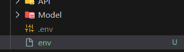

Đầu tiên, vô gg cloud console để lấy key

Tiếp theo, đổi tên file này thành .env 

#### (nhớ dấu chấm, và chắc chắn là .env nó màu xám - nghĩa là đẫ được gitignore, như hình thì hẳn push code)

Rồi ghi dòng bên dưới là được

GG_API_KEY={API_key here, nhớ bỏ ngoặc nhọn}