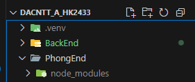
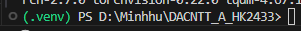

# ☀️ **DACNTT_Solar_Panels**
**Phát triển ứng dụng dự đoán số lượng tấm pin năng lượng mặt trời lắp đặt trên mái nhà**  
_Đồ Án CNTT - Học kỳ 2433_

---

## 🚀 Cài đặt nhanh

```bash
    git clone https://github.com/tigerex/DACNTT_Solar_Panels.git
```
---
## PhongEnd Document:
```bash 
    cd /PhongEnd
```
Cài đặt các package cho PhongEnd
```bash
    npm i   
```
Chạy chương trình bằng web
```bash
    npm run 
```
Thêm vô đây please

## BackEnd Document:
**Do it**

## Model Training Document:
Thấy cái folder *.venv* trên cùng trong folder root khom?  
  
Đó là môi trường Python ảo. Tại sao cần? Để không conflict với môi trường trên pc tui. 
Nhưng mà môi trường ảo vẫn nằm trên pc??? SHUT UP TUI KHÔNG BIẾT, VSCODE KÊU TUI LÀM THẾ OK!!!!

**OH NO không có folder .venv nào hết!!! Không sao, tự tạo thôi.**

1. Đứng tại folder root (vì tui thiết kế file như vậy rồi, tạo ở chỗ khác không được ráng chịu)
2. CCái venv là môi trường ảo, cái venv sau đó là tên cho cái môi trường ảo đó, đổi tên tùy ý
```bash 
    python -m venv venv
``` 
3. Giờ thì kích hoạt môi trường ảo lên (dùng xong tắt nó đi thì chỉ cần deactivate vô terminal thôi)
```bash
    venv\Scripts\activate
```
Thế là xong tạo môi trường, và nhìn như vầy là ok!!!!  
  
4. Tiếp theo mấy bạn cài package Pytorch với những thứ khác vô cái môi trường trống trơn này
```bash
    pip install matplotlib numpy torch torchvision segmentation-models-pytorch albumentations tifffile
```  
### Package do wut?  
            | Package                       | Mô tả ngắn gọn                                                 |
            | ----------------------------- | -------------------------------------------------------------- |
            | `matplotlib`                  | Vẽ biểu đồ, hiển thị kết quả trực quan                         |
            | `numpy`                       | Tính toán ma trận, xử lý dữ liệu số                            |
            | `torch`                       | Framework chính để train mô hình deep learning (PyTorch)       |
            | `torchvision`                 | Tiện ích cho việc xử lý ảnh trong PyTorch                      |
            | `segmentation-models-pytorch` | Bộ model segmentation có sẵn (U-Net, DeepLabV3,...)            |
            | `albumentations`              | Thư viện tăng cường ảnh (image augmentation) rất mạnh và nhanh |
            | `tifffile`                    | Đọc và ghi các file ảnh định dạng `.tif`                       |

5. Nào train được model tui chỉ tiếp. efaefaefe