# ☀️ **DACNTT_Solar_Panels**
**Phát triển ứng dụng dự đoán số lượng tấm pin năng lượng mặt trời lắp đặt trên mái nhà**  
_Đồ Án CNTT - Học kỳ 2433_

---

## 🚀 Cài đặt nhanh

```bash
    git clone https://github.com/tigerex/DACNTT_Solar_Panels.git
```
---
## PhongEnd Document:
```bash 
    cd /PhongEnd
```
Cài đặt các package cho PhongEnd
```bash
    npm i   
```
Chạy chương trình bằng web
```bash
    npm run dev
```
Thêm vô đây please

## BackEnd Document:
Tạo môi trường ảo như hướng dẫn dưới phần `Model`.  
Cài các module/thư viện bla bla.
```bash
pip install -r /path/to/requirements.txt
```
Sau đó khởi chạy server.
```bash
uvicorn main:app --reload
```
## Model Training Document:
Thấy cái folder *.venv* trên cùng trong folder root khom?  
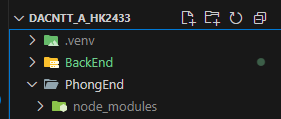  
Đó là môi trường Python ảo. Tại sao cần? Để không conflict với môi trường trên pc tui. 
Nhưng mà môi trường ảo vẫn nằm trên pc??? SHUT UP TUI KHÔNG BIẾT, VSCODE KÊU TUI LÀM THẾ OK!!!!

**OH NO không có folder .venv nào hết!!! Không sao, tự tạo thôi.**

1. Đứng tại folder root (vì tui thiết kế file như vậy rồi, tạo ở chỗ khác không được ráng chịu)
2. Cái `venv` đầu là môi trường ảo, cái venv sau đó là tên cho cái môi trường ảo đó, đổi tên tùy ý
```bash 
    python -m venv venv
``` 
3. Giờ thì kích hoạt môi trường ảo lên (dùng xong tắt nó đi thì chỉ cần deactivate vô terminal thôi)
```bash
    venv\Scripts\activate
```
Thế là xong tạo môi trường, và nhìn như vầy là ok!!!!  
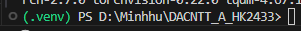  
 4. Tiếp theo mấy bạn cài package Pytorch với những thứ khác vô cái môi trường trống trơn này
```bash
    pip install matplotlib numpy torch torchvision segmentation-models-pytorch albumentations tifffile
```  
- Package do wut?  
    - | `matplotlib`                  | Vẽ biểu đồ, hiển thị kết quả trực quan                         |
    - | `numpy`                       | Tính toán ma trận, xử lý dữ liệu số                            |
    - | `torch`                       | Framework chính để train mô hình deep learning (PyTorch)       |
    - | `torchvision`                 | Tiện ích cho việc xử lý ảnh trong PyTorch                      |
    - | `segmentation-models-pytorch` | Bộ model segmentation có sẵn (U-Net, DeepLabV3,...)            |
    - | `albumentations`              | Thư viện tăng cường ảnh (image augmentation) rất mạnh và nhanh |
    - | `tifffile`                    | Đọc và ghi các file ảnh định dạng `.tif`                       |

5. Ok, sau khi đã có môi trường hoàn hảo rồi thì bây giờ các bạn có thể làm gì để coi mấy thứ tui đã làm?
    - Có 2 file .ipynb
       - file model_train thì như cái tên, để train model
       - file testIMG là nơi tui tiền xử lí ảnh trước khi đưa vào train
       - Vậy ảnh đâu? Rất tiếc tui không thể đưa toàn bộ dataset lên đây, do nó quá nặng (20GB)
       - Tui có để vài ảnh cho các bạn quậy:
          - Model đọc file .tif nên file .png hay .jpe cần được đổi lại => vào testIMG để đổi
          - Hết rồi, tạm thời tới đây thôi

# 👏 Hình ảnh thực tế của project

### User search địa chỉ mong muốn và vẽ polygon lên mái nhà
Thì chức năng này user sẽ xác định mái nhà thủ công, và sau đó web sẽ trả về kết quả lắp đặt solar panel tương ứng với hình dáng mái nhà

<p align="center">
  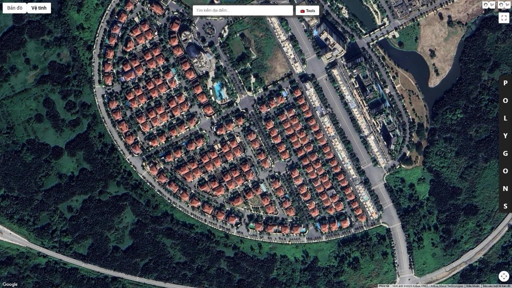
  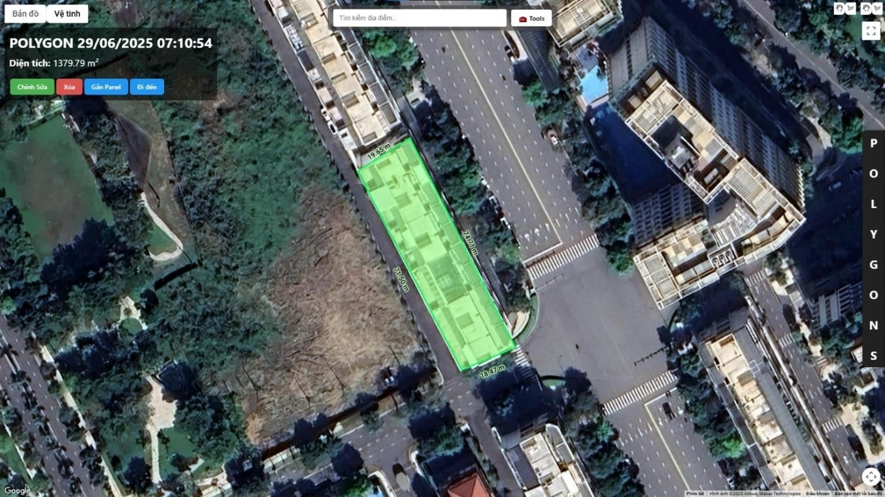
  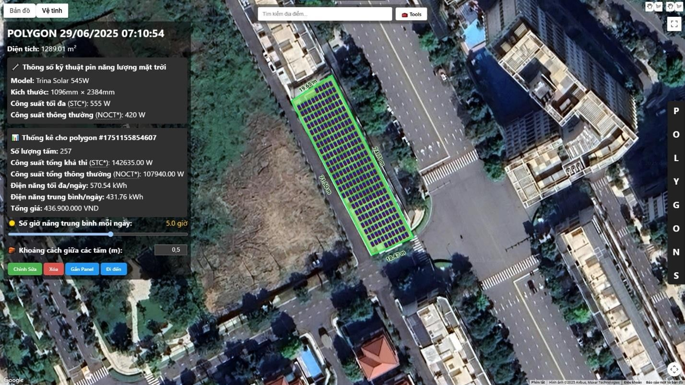
  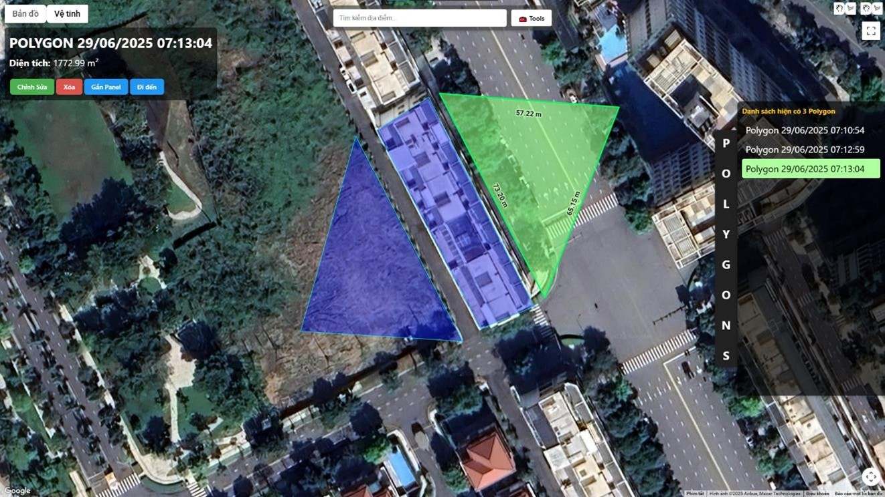
  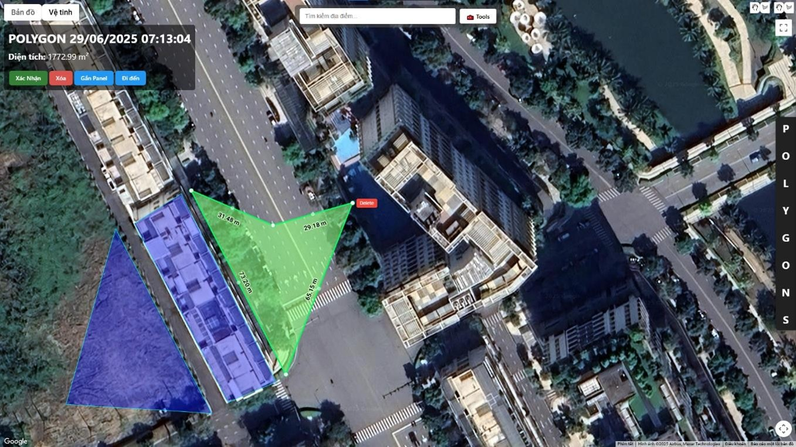
</p>

### Model nhận hình ảnh và tự động nhận diện mái nhà
Chức năng này user chỉ cần snipping vùng nào đó, model sẽ tự nhận diện các mái nhà, và sau đó web sẽ trả về kết quả lắp đặt solar panel tương ứng với hình dáng mái nhà. Tuy nhiên, chức năng này tại thời điểm nộp báo cáo thì chưa hoàn thành, đang ở bước train model và hình ảnh bên dưới là kết quả.     
<p align="center">
  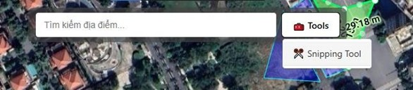
  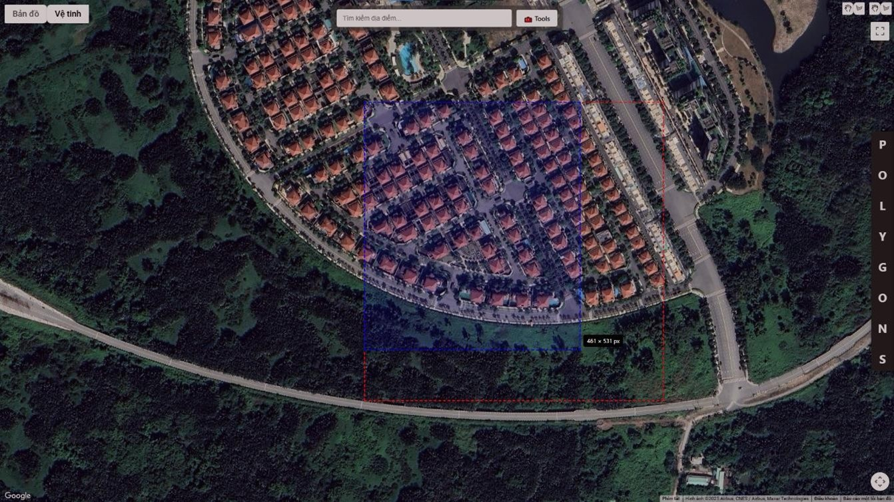
  <br></br>
  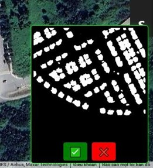
  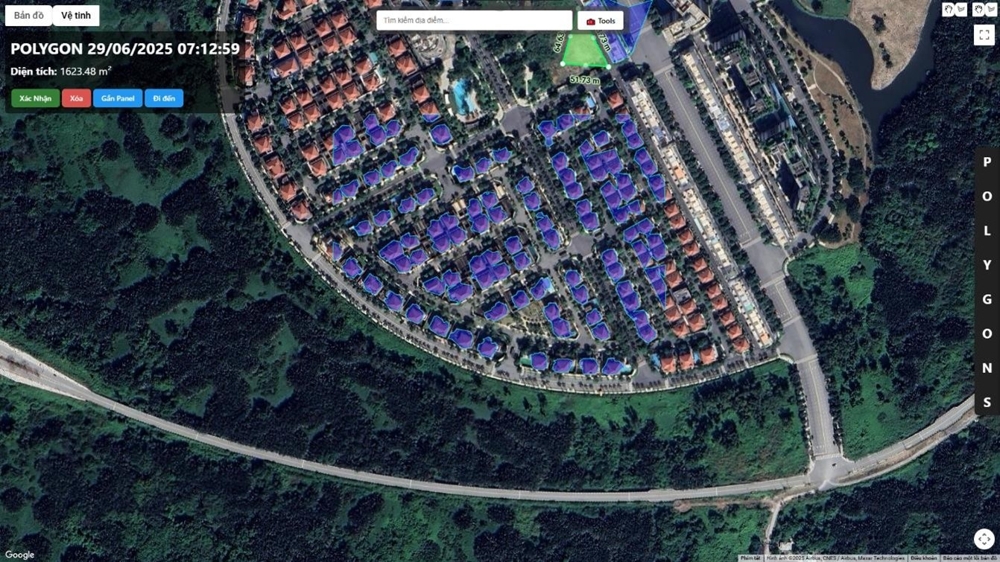
</p>

